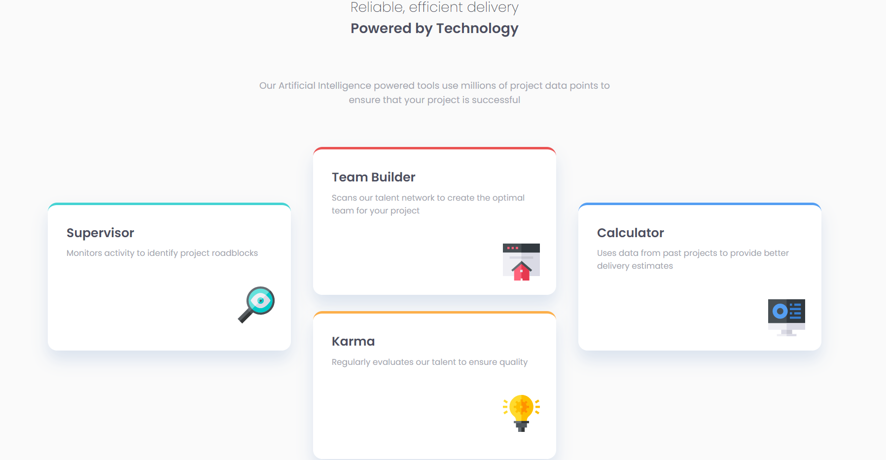
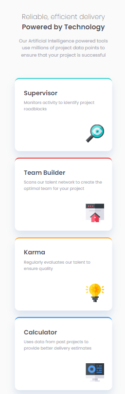

# Frontend Mentor - Four card feature section solution

This is a solution to the [Four card feature section challenge on Frontend Mentor](https://www.frontendmentor.io/challenges/four-card-feature-section-weK1eFYK). Frontend Mentor challenges help you improve your coding skills by building realistic projects. 

## Table of contents

- [Overview](#overview)
  - [The challenge](#the-challenge)
  - [Screenshot](#screenshot)
  - [Links](#links)
- [My process](#my-process)
  - [Built with](#built-with)
  - [What I learned](#what-i-learned)
  - [Continued development](#continued-development)
  - [Useful resources](#useful-resources)
- [Author](#author)

## Overview

### The challenge

Users should be able to:

- View the optimal layout for the site depending on their device's screen size

### Screenshot

### Links

- Solution URL: [Frontend Mentor](https://www.frontendmentor.io/solutions/four-card-section-with-mobilefirst-workflow-flexbox-and-sass-iIP3F4r9_)
- Live Site URL: [Github Pages](https://diopmorfall.github.io/four-card-feature-section-master/)

## My process

### Built with

- Semantic HTML5 markup
- CSS custom properties
- Sass
- Flexbox
- Mobile-first workflow

### What I learned

I reinforced my knowledge about mobile-first development, Sass and flexbox which allowed me to replicate at my best the layout as required.

### Continued development

Surely I want to look back at this project to take inspiration from it for my future projects, but I want also to improve it to make it look as close as the requested design.

### Useful resources

- [Box Shadow Generator](https://developer.mozilla.org/en-US/docs/Web/CSS/CSS_Backgrounds_and_Borders/Box-shadow_generator) - This helped me understand how I can generate a shadow like the one in the design.

## Author

- Frontend Mentor - [@diopmorfall](https://www.frontendmentor.io/profile/diopmorfall)
- LinkedIn - [Mor Fall Diop](https://www.linkedin.com/in/mor-fall-diop-07b40a18b)
